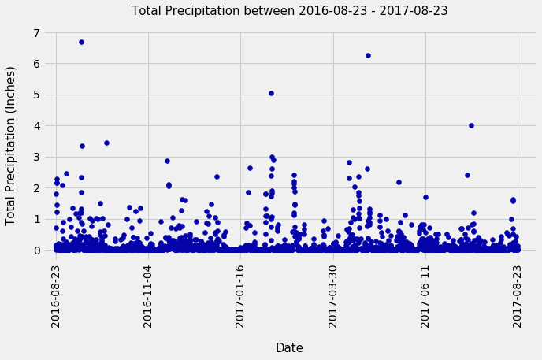
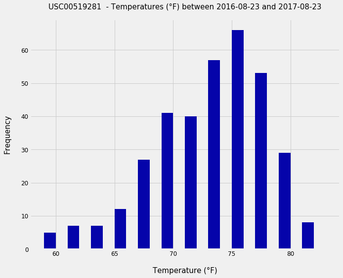
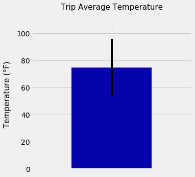
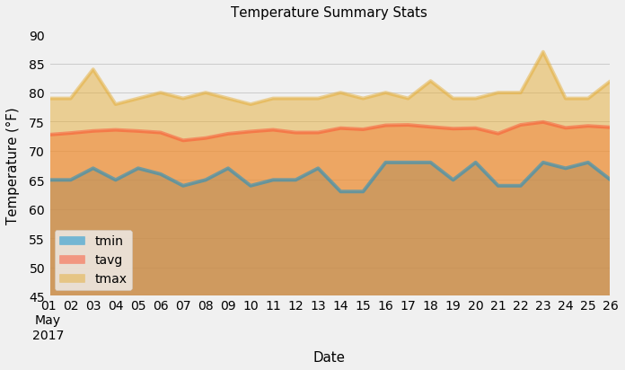

# Surfs Up!

Congratulations! You've decided to treat yourself to a long holiday vacation in Honolulu, Hawaii! To help with your trip planning, I conducted a climate analysis on the area. 

## Step 1 - Climate Analysis and Exploration

I used Python and SQLAlchemy to do basic climate analysis and data exploration of a climate database. The following analysis was completed using SQLAlchemy ORM queries, Pandas, and Matplotlib.

* See [starter notebook](climate_starter.ipynb) and [hawaii.sqlite](Resources/hawaii.sqlite) for the climate analysis and data exploration.

### Precipitation Analysis

* Designed a query to retrieve the last 12 months of precipitation data.

* Used Pandas to analyze the output

* Plotted the results using the DataFrame `plot` method.

  

### Station Analysis

* Designed a query to calculate the total number of stations.

* Designed a query to find the most active stations.

* Designed a query to retrieve the last 12 months of temperature observation data (TOBS).

    

- - -

## Step 2 - Climate App

I designed a [Flask API](app.py) based on the above queries and used Flask to create web framework. 

### Routes

* `/`

  * Home page.

  * Lists all routes that are available.

* `/api/v1.0/precipitation`

  * Converts the query results to a dictionary using `date` as the key and `prcp` as the value.

  * Returns the JSON representation of your dictionary.

* `/api/v1.0/stations`

  * Returns a JSON list of stations from the dataset.

* `/api/v1.0/tobs`
  * Queries the dates and temperature observations of the most active station for the last year of data.
  
  * Returns a JSON list of temperature observations (TOBS) for the previous year.

* `/api/v1.0/<start>` and `/api/v1.0/<start>/<end>`

  * Returns a JSON list of the minimum temperature, the average temperature, and the max temperature for a given start or start-end range.

  * When given the start only, calculates `TMIN`, `TAVG`, and `TMAX` for all dates greater than and equal to the start date.

  * When given the start and the end date, calculates the `TMIN`, `TAVG`, and `TMAX` for dates between the start and end date inclusive.

### Temperature Analysis I

Hawaii is reputed to enjoy mild weather all year. Is there a meaningful difference between the temperature in, for example, June and December?

* Identify the average temperature in June at all stations across all available years in the dataset. Do the same for December temperature.

* Used the t-test to determine whether the difference in the means, if any, is statistically significant. 

## Step 3 - Further Climate Analysis 

### Temperature Analysis II

* Used a function to calculate the min, avg, and max temperatures for your trip using the matching dates from the previous year (i.e., use "2017-01-01" if your trip start date was "2018-01-01").

* Plotted the min, avg, and max temperature from your previous query as a bar chart.

    

### Daily Rainfall Average

* Calculated the rainfall per weather station using the previous year's matching dates.

* Calculated the daily normals. Normals are the averages for the min, avg, and max temperatures.

* Used a function that will calculate the daily normals for a specific date. This date string will be in the format `%m-%d`. Be sure to use all historic TOBS that match that date string.

* Created a list of dates for your trip in the format `%m-%d`. Use the `daily_normals` function to calculate the normals for each date string and append the results to a list.

* Loaded the list of daily normals into a Pandas DataFrame and set the index equal to the date.

* Used Pandas to plot an area plot for the daily normals.

  
